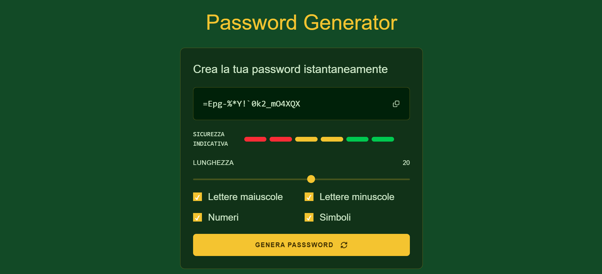

# Password Generator

Generatore di password sicure e personalizzabili realizzato in HTML, CSS e JavaScript vanilla.

L'applicazione permette di creare password casuali con lunghezza regolabile e la possibilità di includere lettere maiuscole, minuscole, numeri e simboli.

## ✨ Features

- Generazione di password casuali
- Lunghezza personalizzabile da 8 a 30 caratteri
- Selezione delle categorie:
  - lettere maiuscole
  - lettere minuscole
  - numeri
  - simboli
- Indicatore visivo del livello di sicurezza
- Copia della password negli appunti
- Nessun backend: tutto gira nel browser

## 💻 Tech Stack

- HTML5
- CSS3
- JavaScript
- Tailwind CSS

## 📷 Preview
